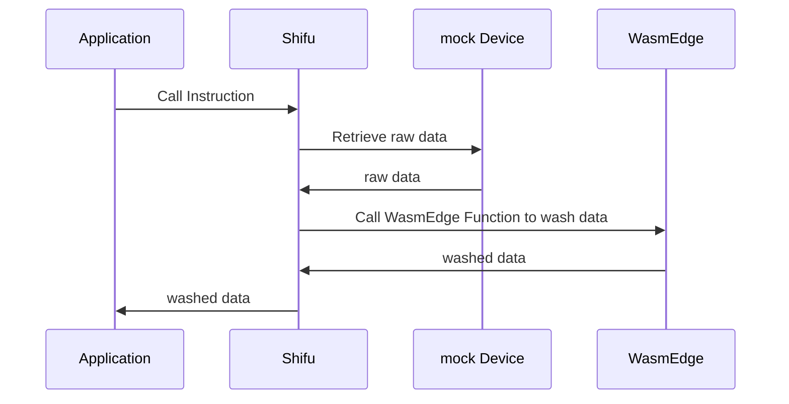

# shifu && WasmEdge



## Input: Sample raw data

```json
{
   "statusCode":"200",
   "message":"success",
   "entity":[
      {
         "datetime":"2022-08-18 19:43:34",
         "eUnit":"℃",
         "eValue":"27.4",
         "eKey":"e3",
         "eName":"大气温度",
         "eNum":"101"
      },
      {
         "datetime":"2022-08-18 19:43:34",
         "eUnit":"%RH",
         "eValue":"82.5",
         "eKey":"e4",
         "eName":"大气湿度",
         "eNum":"102"
      },
   ],
   "deviceId":18000856,
   "deviceName":"18000856"
}
```

## Output: sample washed data

if temperature > 28 exception = 温度过高; else exception = 温度正常  
if humidity > 82 exception = 湿度过高; else exception = 湿度正常

```json
[
   {
      "code":"18000856",
      "datetime":"2022-08-18 19:43:34",
      "name":"大气温度",
      "val":"27.4",
      "unit":"℃",
      "exception":"温度正常"
   },
   {
      "code":"18000856",
      "datetime":"2022-08-18 19:43:34",
      "name":"大气湿度",
      "val":"82.5",
      "unit":"%RH",
      "exception":"湿度过高"
   }
]
```

## Step by step guide

### Build deviceshifu demo

```bash
pushd shifu && make buildx-build-image-deviceshifu-http-http && popd
```

### Build and run mock device

```bash
docker build -f mockDevice/dockerfile -t mockdevice:v0.0.1 .
```

Run docker image and expose 8099 port:

```bash
docker run -p 8099:8099 -itd mockdevice:v0.0.1 
```

### Build and run WasmEdge

You can write the rules in [wasmEdge/js-func/src/js/run.js](wasmEdge/js-func/src/js/run.js).

**TODO: You Should Edit js's line 9 and 10 to modify the threshold**

Build wasm image with edited Javascript file:

```bash
docker build -t wasm:v0.0.1 -f wasmEdge/js.dockerfile  .
```

Load wasm image into kind cluster:

```bash
kind create cluster
kind load docker-image wasm:v0.0.1
kubectl apply -f wasmEdge/k8s
```

You can use the following command to check if your wasmEdge is running:

```bash
kubectl get pod -n wasmedge
```

## Run shifu and deviceshifu

install Shifu into kind cluster

```bash
kubectl apply -f shifuConfig/shifu_install.yml
```

You can now use the following command to check your shifu is installed

```bash
kubectl get pod -n shifu-crd-system
```

Install deviceShifu to communicate with the mockDevice. Remember to modify the IP address first. Below is a code snippet from [shifuConfig/task3](shifuConfig/task3/task3.yaml). Edit the `address` field accordingly.

```yaml
spec:
  sku: "E93"
  connection: Ethernet
  address: "192.168.14.163:8099"
```

```bash
kind load docker-image edgehub/deviceshifu-http-http:v0.0.6
kubectl apply -f shifuConfig/task3
```

You can use the following command to check if your deviceshifu is running:

```bash
kubectl get pod -n deviceshifu
```

### Test

First, create a nginx pod:

```bash
kubectl run nginx --image=nginx:1.21
kubectl get pod 
```

After nginx is running, you can the following command to enter the nginx pod

```bash
kubectl exec -it nginx bash
```

you can now use the following command to get deviceinfo by deviceshifu

```bash
curl http://deviceshifu-demodevice-service.deviceshifu.svc.cluster.local/get_info
```
