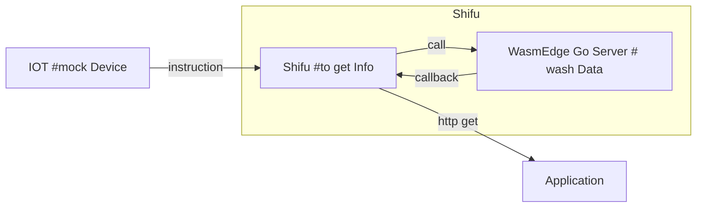
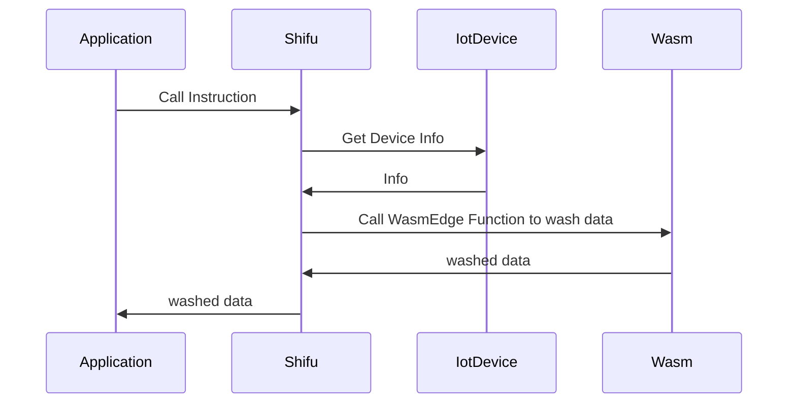

# shifu && WasmEdge
# 




## Iot Output
```
{
   "statusCode":"200",
   "message":"success",
   "entity":[
      {
         "datetime":"2022-08-18 19:43:34",
         "eUnit":"℃",
         "eValue":"27.4",
         "eKey":"e3",
         "eName":"大气温度",
         "eNum":"101"
      },
      {
         "datetime":"2022-08-18 19:43:34",
         "eUnit":"%RH",
         "eValue":"82.5",
         "eKey":"e4",
         "eName":"大气湿度",
         "eNum":"102"
      },
   ],
   "deviceId":18000856,
   "deviceName":"18000856"
}
```
## result 
if temperature > 28 exception = 温度过高; else exception = 温度正常  
if humidity > 82 exception = 湿度过高; else exception = 湿度正常
```
[
   {
      "code":"18000856",
      "datetime":"2022-08-18 19:43:34",
      "name":"大气温度",
      "val":"27.4",
      "unit":"℃",
      "exception":"温度正常"
   },
   {
      "code":"18000856",
      "datetime":"2022-08-18 19:43:34",
      "name":"大气湿度",
      "val":"82.5",
      "unit":"%RH",
      "exception":"湿度过高"
   }
]
```

# How to run ?
## first build deviceshifu demo
pushd shifu && make buildx-build-image-deviceshifu-http-http && popd
## build and run mock device
build mockdevice image if you have go environment, you can run the `mockDevice/mockDevice.go` in the background instead of using image.
```bash
docker build -f mockDevice/dockerfile -t mockdevice:v0.0.1 .
```
run docker image and expose 8099 port.
```bash
docker run -p 8099:8099 -itd mockdevice:v0.0.1 
```
## build and run wasmEdge
You can write the rule on wasmEdge/js-func/src/js/run.js  
*You Should Edit js's line 9 and 10 to modify threshold*
build wasm image with edited js
```bash
docker build -t wasm:v0.0.1 -f wasmEdge/js.dockerfile  .
```
load wasm image into kind cluster
```bash
kind create cluster
kind load docker-image wasm:v0.0.1
kubectl apply -f wasmEdge/k8s
```
You can use flowing command to check your wasmEdge is running
```bash
kubectl get pod -n wasmedge
```

## run shifu and deviceshifu
install Shifu into kind cluster
```bash
kubectl apply -f shifuConfig/shifu_install.yml
```
You can use flowint command to check your shifu is installed
```bash
kubectl get pod -n shifu-crd-system
```
install deviceShifu for monitoring mockDevice. but you should modify address to your IP address first on `edgedevice/spec/address` in`shifuConfig/Shifu1/shifu1.yaml` 
```
kind load docker-image edgehub/deviceshifu-http-http:v0.0.6
kubectl apply -f shifuConfig/Shifu1
```
You can use flowint command to check yout deviceshifu is running
```bash
kubectl get pod -n deviceshifu
```
## test
You can create nginx using curl to test the program is ok
```bash
kubectl run nginx --image=nginx:1.21
kubectl get pod 
```
After nginx is running, you can using flowing command to entry the nginx pod
```bash
kubectl exec -it nginx bash
```
you can using following command to get deviceinfo by deviceshifu
```bash
curl http://deviceshifu-demodevice-service.deviceshifu.svc.cluster.local:8080/get_info
```