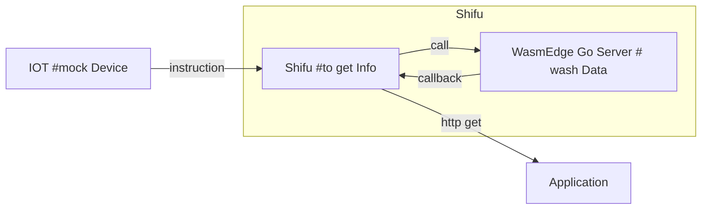
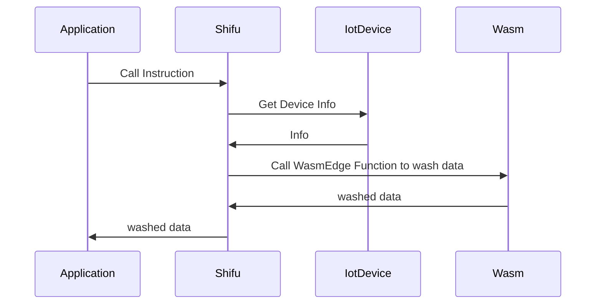

# shifu && WasmEdge
# 




## Iot Output
```
{
   "statusCode":"200",
   "message":"success",
   "entity":[
      {
         "datetime":"2022-08-18 19:43:34",
         "eUnit":"℃",
         "eValue":"27.4",
         "eKey":"e3",
         "eName":"大气温度",
         "eNum":"101"
      },
      {
         "datetime":"2022-08-18 19:43:34",
         "eUnit":"%RH",
         "eValue":"82.5",
         "eKey":"e4",
         "eName":"大气湿度",
         "eNum":"102"
      },
   ],
   "deviceId":18000856,
   "deviceName":"18000856"
}
```
## result
```
[
   {
      "code":"20990922009",
      "datetime":"2022-08-18 19:43:34",
      "name":"大气温度",
      "val":"37",
      "unit":"℃",
      "exception":"温度过高"
   },
   {
      "code":"20990922009",
      "datetime":"2022-08-18 19:43:34",
      "name":"大气湿度",
      "val":"35",
      "unit":"%RH",
      "exception":"湿度过高"
   }
]
```

# How to run ?
## build deviceshifu
make buildx-build-image-deviceshifu-http-http 
## run mock device
```bash
docker build . -t mockdevice:v0.0.1
docker run -p 8099:8099 -itd mockdevice:v0.0.1 
```
## run shifu
```
kubectl apply -f shifuConfig/shifu_install.yml
kubectl apply -f shifuConfig/Shifu1
```

## run wasmEdge
rules path: wasmEdge/js-func/src/js/run.js
> docker build . -t wasm:v0.0.1 -f dockerfile
> docker run -p 8080:8080 -itd wasm:v0.0.1